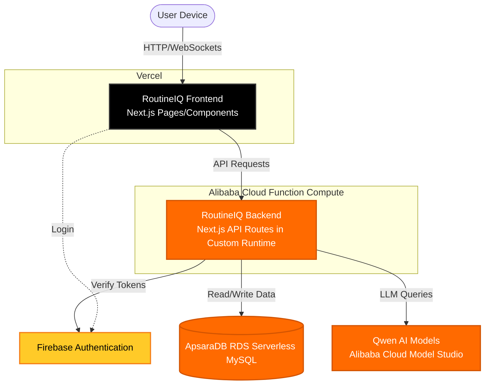

# RoutineIQ Architecture

RoutineIQ uses a modern, serverless split-architecture to optimize for performance, global distribution, and AI integration. 

## High-Level Flow

## Components

### 1. Frontend (Vercel)
The user interface is built with React and Tailwind CSS. It is deployed to Vercel for fast, edge-cached delivery to users worldwide. The frontend handles client-side authentication and communicates with the backend via REST API calls.

### 2. Backend (Alibaba Cloud Function Compute)
The heavy lifting—including AI processing, database operations, and secure token verification—is processed serverless-ly on Alibaba Cloud. The Next.js API Routes are compiled into a Standalone Node.js server and deployed as a Custom Runtime on Alibaba Cloud Function Compute. This ensures high-performance backend logic while keeping AI processing close to the Qwen models.

### 3. Core Services
- **AI (Qwen)**: Alibaba Cloud's Qwen models handle the intelligent chat, routine generation, and product analysis.
- **Database (ApsaraDB)**: A highly available ApsaraDB RDS Serverless MySQL database hosted on Alibaba Cloud, accessed via Prisma ORM.
- **Authentication (Firebase)**: Handles user signups, logins, and issues secure JWTs that the backend verifies.
