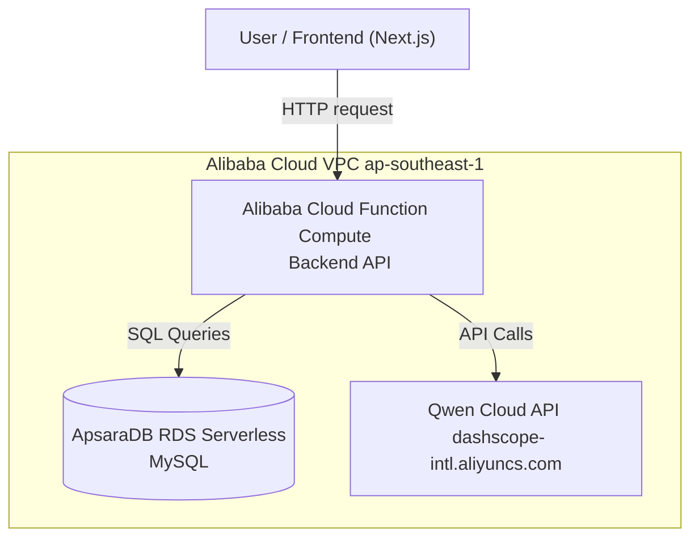

# RoutineIQ

RoutineIQ is an AI-powered dermatology assistant that tracks routines and logs side effects.

## Deployment (Alibaba Cloud)

- **Backend:** Alibaba Cloud Function Compute (Web Function, Node.js), region ap-southeast-1
- **Database:** ApsaraDB RDS Serverless (MySQL), auto-pause enabled
- **AI Model:** Qwen Cloud API (Qwen-Max) via dashscope-intl.aliyuncs.com
- **Networking:** Private VPC connecting Function Compute to RDS
- **Live endpoint:** https://routineiq-itblaotrkx.ap-southeast-1.fcapp.run
- **Proof of Alibaba Cloud usage (Code):** [See src/lib/db.ts](./src/lib/db.ts)
- **Proof of Alibaba Cloud usage (Deployment):**  
  

## Architecture

## Run Locally

**Prerequisites:** Node.js

1. Install dependencies:
   `npm install`
2. Set your environment variables in `.env` (Database, Alibaba Cloud credentials).
3. Run the app:
   `npm run dev`
